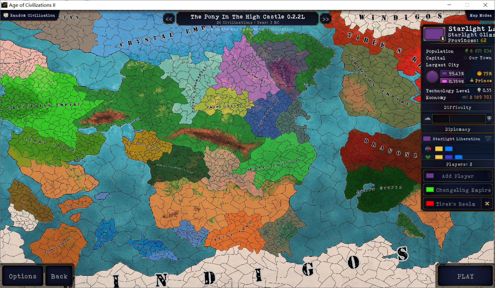

# <center> Age of History II: The Pony In The High Castle MOD</center>

Latest Public Version: [0.2.2L](https://github.com/Magolor/AoH2-PIHC/releases/tag/0.2.2L)

Latest Working Version: 0.2.3L

## What is "The Pony In The High Castle" MOD? 什么是"高堡奇驹"模组？

PIHC MOD: "The Pony In The High Castle" MOD is a mod for game AoH2 (Age of History II). The setting of the mod is based on the re-creation of the famous cartoon MLP (_My Little Pony_) series.
PIHC"高堡奇驹"MOD是文明时代2的游戏模组。此模组的剧情设定为著名动画系列《小马宝莉》的同人创作。

In this fictional world, Cozy Glow, Queen Chrysalis and Lord Tirek won the Ultimate Battle (S09E24, S09E25), instead of M6 in the official episodes.
在这样一个架空世界中，和熙光流、虫茧女王和提雷克领主，而不是M6，取得了终末之战的胜利。



This MOD is designed to be a part of a whole series of multimedia projects under the same setting —— PIHC world.
此模组计划为同一世界观设定下（"高堡奇驹"世界）的系列多媒体工程之一。

Other parts of the series:
- Music: [youtube](https://www.youtube.com/playlist?list=PLsrkfVTe5kZkb_suB9i5c27vWH3_7xD1T), [bilibili](https://space.bilibili.com/409790680/channel/detail?cid=168396), [netease](https://music.163.com/#/album?id=98865624). Continuously updating.
- Trailer:
	- PIHC MOD Official Trailer: [youtube](https://www.youtube.com/watch?v=ZAbT8mwrUb0), [bilibili](https://www.bilibili.com/video/BV1EX4y1L7mR).
- Interactive Video: Coming ~~Soon~~.
- Novels: Not in foreseeable future.
- Fan-fiction paintings: Not in foreseeable future unless with a volunteer.
- Fan-fiction animation: Not in foreseeable future unless with a volunteer.

此系列的其他内容包括：
- 音乐： [油管](https://www.youtube.com/playlist?list=PLsrkfVTe5kZkb_suB9i5c27vWH3_7xD1T)，[哔哩哔哩](https://space.bilibili.com/409790680/channel/detail?cid=168396)， [网易云音乐](https://music.163.com/#/album?id=98865624)。持续更新中。
- 预告片：
	- 高堡奇驹模组正式预告：[油管](https://www.youtube.com/watch?v=ZAbT8mwrUb0)，[哔哩哔哩](https://www.bilibili.com/video/BV1EX4y1L7mR)。
- 互动视频：~~即将~~推出。
- 小说：暂无计划。
- 同人插画：暂无计划，除非有志愿者。
- 同人动画: 暂无计划，除非有志愿者。

<br/>

## Installation 安装教程

### PC

The relatively new version of Age of History II from steam is required. ——Feb. 2021
需要拥有较新的steam版本文明时代2。——2021年2月

We use the version 0.2.2L as a demonstration.
下面以版本0.2.2L为例演示安装方法。

Download the rar or zip file in [0.2.2L release](https://github.com/Magolor/AoH2-PIHC/releases/tag/0.2.2L) to your local disk. Or you can download through [Baidu Cloud Disk](https://pan.baidu.com/s/1_fEH_VE7n0v5SlP_L1SXew) (code: rv8j) or QQ channael (934449651). 
首先下载[版本0.2.2L](https://github.com/Magolor/AoH2-PIHC/releases/tag/0.2.2L)中的rar或zip文件到本地。也可以通过[百度网盘](https://pan.baidu.com/s/1_fEH_VE7n0v5SlP_L1SXew) (code: rv8j)或QQ群 (934449651)下载。

Then copy all the sub directories of the folder "PIHC-0.2.2L/" into your game folder (e.g.: "\<path to steam\>/steamapps/common/AoCII/"), and replace all files if any conflict occurs.
然后复制"PIHC-0.2.2L/PC/"目录下的所有子文件夹到您的游戏目录 (例如: "\<您的steam目录\>/steamapps/common/AoCII/")，如果出现同名文件选择全部替换。

Finally, change the file "\<path to steam\>/steamapps/common/AoCII/map/Age_of_Civilizations.json" by adding the following lines:
最后，修改文件"\<您的steam目录\>/steamapps/common/AoCII/map/Age_of_Civilizations.json"，加入以下几行文本：

```
        {
            Folder: "PIHC-0.2.2-large"
        },
```

Now the installation is done. Enjoy!
安装完成。尽情享受！

### Android

Directly Download the apk file in [0.2.2L release](https://github.com/Magolor/AoH2-PIHC/releases/tag/0.2.2L) and install it on your phone or whatever else Android device.
直接下载[版本0.2.2L](https://github.com/Magolor/AoH2-PIHC/releases/tag/0.2.2L)中的apk文件安装到您的手机或其他任何安卓设备上。

If you are stuck at the first time loading the game, just quit the game and try it again, with a large probability it would work well.
如果您在第一次加载文件时游戏卡住了，直接退出游戏重新进入，大概率会有效。

Now the installation is done. Enjoy!
安装完成。尽情享受！

<br/>

## Change Log 更新日志

_Note: "T" stands for "tiny", "S" for "small", "M" for "medium", "L" for "large" and "H" for huge, with respect to the number of provinces. 版本号中T,S,M,L,H代表地图大小（省份数目）从小到大。_

### 2021.02.23 0.2.2L

- **Android Mobile Support. 支持安卓手机版。**
- English and Chinese language support. 支持英语和中文双语。
- Several bugfixes. 修正了若干错误。
- Minor balancing. 微小的平衡性修正。
- Font replaced. 字体替换。
- Header replaced. 头图替换。
- Loading lines replaced (English only), 28 in total. 启动语替换（仅英语），共28条。
- Music added. 添加了音乐。
  - "For Fluttery!" (”为了柔柔！“)
- 16 cities in total. 16个城市。
- Civilizations Rename: Cozy Glow's Feudal Equestria -> Equestria Empire, Derpy's Feudal Cloudsdale -> Feudal Cloudsdale, Discord Legion -> Chaos Legion, Trixie Lulamoon's Feudal Ponyville -> Feudal Ponyville. 和熙光流的封建小马国->小马利亚帝国, 小呆的云中城封地->封建云中城, 无序军团->混沌军团, 崔克西的小马谷封地->封建小马谷。
- Added 23 leaders without portraits: Starlight Glimmer (for Starlight Liberation Front), Lord Tirek (for Tirek's Realm), Cozy Glow (for Equestria Empire), Queen Chrysalis (for Changeling Empire), Trixie Lulamoon (for Feudal Ponyville), Zecora (for Zebra Tribe), Gift Givers (for The Reindeers In The High Castle), Flim & Flam (for Los Pegasus Syndicate), Windigos (for Windigos), Flurry Heart (for Crystal Empire), Derpy Hooves (for Cloudsdale), Sunset Shimmer (for The Mirror Dimension), Autumn Blaze (for Kirin Utopia), Capper (for Kluge Town), Discord (for Chaos Legion), Braeburn (for Appleloosa Autonomous Region), Maud Pie (for Rockfarm Autonomous Region), Queen Novo (for Hippogriff Kingdom), Ember (for Dragonland), Prince Rutherford (for Yakyakistan), Gladmane (for Manehatton Gang), Grampa Gruff (for Griffon Empire), Ahuizotl (for Ahuizotl's Jurisdiction). 添加了23位无肖像领袖: 星光熠熠（星光解放阵线），提雷克领主（提雷克领地），和熙光流（小马利亚帝国），虫茧女王（幻形灵帝国），崔克西（封建小马谷），泽科拉（斑马部落），赠礼精灵（驯鹿），弗立姆弗莱姆兄弟（洛马基财团），风之魔（风之魔），风雪之心（水晶帝国），小呆（云中城），余晖烁烁（镜中世界），秋烨（麒麟乌托邦），卡帕（克鲁格镇），无序（混沌军团），布雷本（苹果鲁萨自治区），石灰派（采石农场自治区），诺沃女皇（骏鹰/海马王国），琥珀（龙族），卢瑟福王子（牦牛亚克斯坦），格拉德马（曼哈顿黑帮），古鲁爷爷（狮鹫帝国），水猴（水猴辖区）。

### 2021.02.03 0.2.1L

- **2164 provinces: 2014 land provinces, 150 sea provinces. Made by the auto contour drawer. Manually linked. Playable. 2164个省份：2014个陆地省份，150个海洋省份。由省份生成器制作。手工连接。可玩。**
- Music added. 添加了音乐。
  - The Pony In The High Castle (高堡奇驹)
  - Jahr Null (新元年)
- Icon added. 添加了图标。

### 2021.02.03 0.2.0L

- Map prettified. 地图美化。
- **An auto contour drawer** (written in python) that automatically builds the game mod's province data from the contour image of the provinces. Small manual corrections are needed. 一个自动省份生成器 (python代码)，可以通过地图上的省份轮廓自动生成省份数据。
- 2062 provinces: 1964 land provinces, 98 sea provinces. Made by the auto contour drawer. No links built. 2062个省份：1964个陆地省份，98个海洋省份。由省份生成器制作。尚未建立连接。

### 2021.01.23 0.1.0T

- **Map of Size 9676×5448 pixels based on an unofficial Equestria map. 9676×5448像素地图，根据同人创作地图改编。**
- 71 provinces: 42 land provinces, 32 sea provinces. Made manually. playable. 71个省份：42个陆地省份，32个海洋省份。手工制作。可玩。
- **Initial 24 civilizations**: Ahuizotl's Jurisdiction, Appleloosa Autonomous Region, Changeling Empire, Cozy Glow's Feudal Equestria, Crystal Empire, Derpy's Feudal Cloudsdale, Discord Legion, Drangonland, Griffon Empire, Hippogriff Kingdom, Kirin Utopia, Kluge Town, Los Pegasus Syndicate, Manehatton Gang, Rockfarm Autonomous Region, Saddle Arabia, Starlight Liberation Front, The Mirror Dimension, The Reindeers In The High Castle, Tirek's Realm, Trixie Lulamoon's Feudal Ponyville, Windigos, Yakyakistan, Zebra Tribe. 初始的24个文明：水猴辖区, 苹果鲁萨自治区, 幻形灵帝国, 和熙光流的封建小马国, 水晶帝国, 小呆的云中城封地, 无序军团, 龙族, 狮鹫帝国, 骏鹰/海马王国, 麒麟乌托邦, 克鲁格镇, 洛马基财团, 马哈顿黑帮, 采石农场自治区, 马鞍阿拉伯, 星光解放阵线, 镜中世界, 驯鹿, 提雷克领地, 崔克西的小马谷封地, 风之魔, 牦牛亚克斯坦, 斑马部落。

<br/>

## To Do List 计划

- ✅ 0.1.0T
- ✅ 0.2.0L
- ✅ (0.2.1L) Optimize Yakyakistan, Appleloosa Autonomous Region and Changeling Empire. 优化牦牛亚克斯坦，苹果鲁萨自治区，幻形灵帝国。
- ✅ (0.2.1L) Improve the auto contour drawer. 优化省份生成器。
- ✅ (0.2.1L) Link the provinces in large map. ~~Will probably make an auto linker.~~ 在大图中建立连接。~~可能会写一个自动脚本。~~
- ✅ (0.2.1L) Create a small amount of cities. 创建少量城市。
- ✅ (0.2.1L) Publicize 0.2.1L, the first public version. 公布第一个公开版本0.2.1L。
- **✅ (0.2.2L) Android Mobile Support. 支持安卓手机版。**
- ✅ (0.2.2L) Create leaders for each civilization. 创建领袖。
- ⬜ (0.2.3L) Balance adjustments. 平衡性调整。
- ⬜ (0.2.3L) Create more cities. 创建更多城市。
- ⬜ (0.2.3L) Chinese Loading lines. 中文启动语。
- ⬜ (0.2.3L) Create simple scenarios with events. 创建简单的事件剧本。
- ⬜ (0.2.4L) Leader portraits and flags for each civilization. 领袖肖像和旗帜。
- ...

<br/>

## Community 社区

**Official MOD development and testing QQ channel: 934449651. The community has just started and needs your support. You could join in to inform us about suggestions of improvement or BUGs or anything else.**
**官方模组开发与测试QQ群: 934449651。社区刚刚建立，需要您的支持！您可以加入QQ群来反馈改进意见或BUG或其他任何事情。**

<br/>

## Acknowledgement 鸣谢

Developers:
- Talirian (me): MOD Founder & Map developer & PC MOD designer/developer.
- 尖峰Gren: Android MOD developer & PC MOD developer.
- vagrant137, Norway, 特瓦伊莱特: The first testers.
- porkied: MOD Proposer.

Helpers:
- 下木枕流, 以德待人, 从〇开始的鸽子生活, ... (from AoH2:Weita MOD production group). 

开发者：
- Talirian (我)：模组创始者 & 地图开发者 & PC模组设计者/开发者。
- 尖峰Gren：安卓模组开发者 & PC模组开发者。
- vagrant137，Norway，特瓦伊莱特：首批体验者们。
- porkied：模组提议者。

帮助者：
- 下木枕流，以德待人，从〇开始的鸽子生活等人。（来自文明时代2：维他模组制作组）。

<br/>

## Contributing 贡献

This project is powered by nothing but my own passion and completely free. However, it is impossible to finish all the works by my own.
这项工程完全由我个人用爱发电。然而，仅凭我个人不可能完成这巨大量的工作。

If you would like to offer any kind of help, please contact through any one of github, bilibili (Talirian, UID 409790680), netease (Talirian), email (magolor@qq.com), or AoH2 forum (Magolor). I would really appreciate it if you could join us.
如果您有意愿提供任何可能的帮助，请通过GitHub、b站(Talirian, UID 409790680)、网易云(Talirian)、邮箱(magolor@qq.com)或文明时代2论坛(Magolor)中的任何一种联系方式联系我。非常感谢您的帮助！

Especially, painters (for leader portraits, flags, fan-fiction paintings, advertisement, etc.), and balancers (to determine the properties for different civilizations and different regions to design a balanced game experience for civilizations) are in urgent need. Also, I decided to give away AoH2 game on steam (or anything similar you would like) as a small present for the volunteers.
特别地，我们亟需画师（画领袖肖像、国旗、同人插画、宣传，等）和平衡师（设计区域和文明数据，平衡各个文明的游戏体验）。将会在steam上赠送文明时代2游戏本体（或您想要的任何类似物品），作为小小的回赠礼物。

Also, feel free to contact me if you have any question, or something that I could possibly help you.
另外，如果您有任何疑问或是需要我的帮助，也欢迎联系我。

Finally, thank you all for your support, watch or star.
最后，感谢大家的支持、关注和点赞。

<br/>